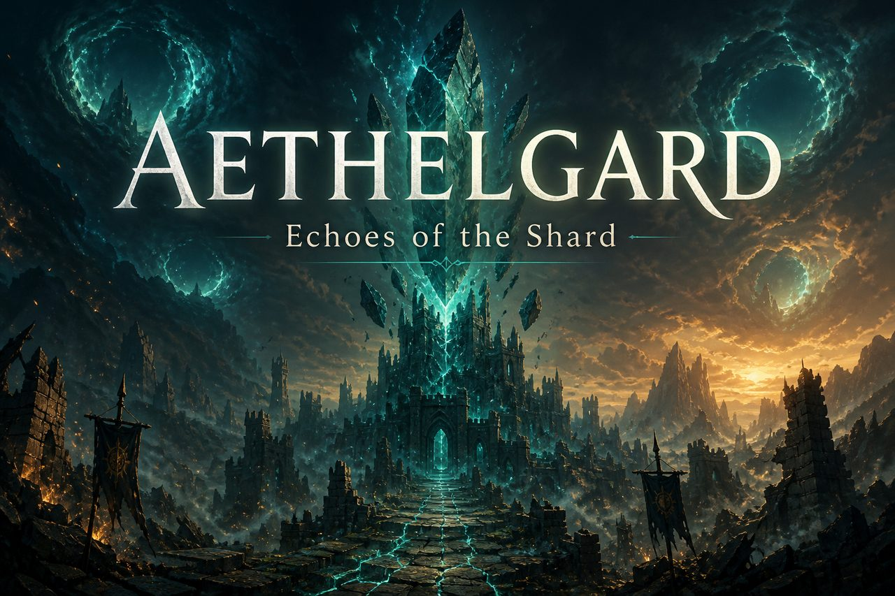

<div align="center">



# Aethelgard
### *Echoes of the Shard*

**Ein Singleplayer- & Koop-Action-RPG** · Godot 4.4 · Pre-Alpha

[](https://godotengine.org/)
[](https://docs.godotengine.org/en/stable/tutorials/scripting/gdscript/index.html)
[](#-aktueller-stand)
[](LICENSE_PROPRIETARY.md)
[](https://github.com/Trobikus/Aethelgard_Shards_of_Eternity/actions)

```text
╔══════════════════════════════════════════════════════════════╗
║   Die Welt ist zersplittert. Die Scherbe ruft.               ║
║   Werde Echoschmied — und webe Macht aus Scherben.           ║
╚══════════════════════════════════════════════════════════════╝
```

[Features](#-kernfeatures) · [Kampfsystem](#-kinetisches-weben) · [Welt](#-die-bastion--die-echos) · [Roadmap](#-aktueller-stand) · [Mitwirken](#-mitwirken)

</div>

---

## Über das Spiel

**Aethelgard: Echoes of the Shard** ist ein fokussiertes Action-RPG, das die epische Reise eines klassischen RPGs mit der endlosen, beutegetriebenen Wiederspielbarkeit eines Hack-&-Slay verbindet — inspiriert von Größen wie *Diablo* und *Path of Exile*, aber gebaut für Solo und kleinen Koop (bis 4 Spieler).

Das Erlebnis gliedert sich bewusst in **zwei Phasen**:

| Phase | Name | Gefühl |
| :---: | :--- | :--- |
| **I** | **Die Kampagne** — *Die Reise* | Handeln, Lernen, Identität finden |
| **II** | **Das Endgame** — *Die Meisterschaft* | Atlas der Echos · Loot · Builds · Bosse |

> Ziel: eine hochgradig polierte Gameplay-Schleife — viszeraler Kampf, strategische Charaktermeisterschaft, unermüdliche Jagd nach Macht.

---

## Kernfeatures

<table>
<tr>
<td width="50%" valign="top">

### Kinetisches Action-Combat
Jeder Angriff und jede Fähigkeit ist ein **physikalisches Objekt**. Zielen. Ausweichen. Positionieren. Kein reines Tab-Targeting — Reflexe entscheiden.

</td>
<td width="50%" valign="top">

### Prozedurale Echos
Erkunde **Scherbenwelten** — instanziierte Taschendimensionen mit neuen Layouts, Monstern und Belohnungen bei jedem Durchlauf.

</td>
</tr>
<tr>
<td width="50%" valign="top">

### Der Echoschmied
Eine flexible Basis statt starrer Klassen. Talentpfade:
- **Wächter** — Tank
- **Weber** — Support
- **Schnitter** — DPS  

Hybride Builds willkommen.

</td>
<td width="50%" valign="top">

### Beute & Handwerk
Zufällige Affixe, build-verändernde **Uniques**, deterministisches Crafting — die Jagd nach der perfekten Ausrüstung endet nie.

</td>
</tr>
</table>

<div align="center">

| Solo | Koop | Hub | Endgame |
| :---: | :---: | :---: | :---: |
| Volle Kampagne | Bis **3 Freunde** | **Die Bastion** | **Atlas der Echos** |

</div>

---

## Kinetisches Weben

Das Kampfsystem stellt Können vor Automatismen:

```text
         ┌─────────────┐
   Input │  Bewegung   │  Sprint · Ausweichrolle · Stamina
         └──────┬──────┘
                ▼
         ┌─────────────┐
 Combat  │  Nahkampf   │  3-Hit-Kombo · Hitboxen · Timing
         │  Fernkampf  │  Skill-Shots · Projektile
         └──────┬──────┘
                ▼
         ┌─────────────┐
 Feedback│  Schaden    │  HP · Targeting · UI-Balken
         └─────────────┘
```

**Aktuell im Prototyp:** Third-Person-Controller, Dodge & Sprint, Nah- und Fernkampf, Lebenspunkte, erste Gegner-KI, Health-UI.

---

## Die Bastion & die Echos

```text
                    ╭──────────────────╮
                    │   ATLAS DER      │
                    │   ECHOS          │
                    ╰────────┬─────────╯
                             │
         ┌───────────────────┼───────────────────┐
         │                   │                   │
         ▼                   ▼                   ▼
    ┌─────────┐         ┌─────────┐         ┌─────────┐
    │ Echo A  │         │ Echo B  │         │ Echo C  │
    │ Layouts │         │ Monster │         │  Loot   │
    └────┬────┘         └────┬────┘         └────┬────┘
         │                   │                   │
         └───────────────────┼───────────────────┘
                             ▼
                    ╭──────────────────╮
                    │   DIE BASTION    │
                    │  Hub · Craft ·   │
                    │  Quests · Portal │
                    ╰──────────────────╯
```

- **Die Bastion** — handgefertigter Hub: Händler, Truhe, Handwerk, Portal.
- **Die Echos** — prozedural, instanziiert, solo oder in kleiner Gruppe.

---

## Engine & Stack

| | |
| :--- | :--- |
| **Engine** | Godot **4.4** (Vulkan Forward+) |
| **Sprache** | GDScript |
| **Physik** | Godot Physics |
| **Export** | Linux · Windows · Web (CI) |
| **Repo** | GitHub Actions + Pages |

---

## Aktueller Stand

<details open>
<summary><b>Phase 1 — Prototyping & Core Gameplay</b> (Fokus)</summary>
<br>

| Bereich | Status |
| :--- | :---: |
| 3rd-Person Bewegung (Laufen, Sprint) | ✅ |
| Ausweichrolle / Ausdauer | ✅ |
| Interaktionssystem | ✅ |
| Nahkampf-Kombo (3 Hits) | ✅ |
| Fernkampf Skill-Shot | ✅ |
| Schaden & HP (Spieler / Gegner) | ✅ |
| Erste Gegner-KI | 🔧 |
| Prozedurale Echo-Generierung | ⏳ |
| Hub „Die Bastion“ | ⏳ |
| Inventar & Ausrüstung | ⏳ |
| Loot-Drops | ⏳ |

</details>

**Nächste Meilensteine**
1. Spielbarer Loop: **Hub → Echo → Boss → Loot → Hub**
2. Erster Talentbaum-Pfad (Schnitter)
3. Vertical Slice mit Quest & Boss

Vollständige Planung: [`ROADMAP.md`](ROADMAP.md) · Konzept: [`Game_Konzept.txt`](Game_Konzept.txt)

---

## Projektstruktur

```text
Aethelgard/
├── actors/          # Spieler, Actor-Basis, Gegner-KI
├── items/           # Interaktives / Test-Content
├── levels/          # Szenen (z. B. test_level)
├── projectiles/     # Magic Missile & Co.
├── resources/       # AttackData, Tres-Ressourcen
├── scripts/         # SignalBus, Projectile-Logik
├── ui/              # Game UI, Health Bars (2D / 3D)
├── docs/            # Docs & README-Assets
└── project.godot
```

---

## Steuern (Prototyp)

| Aktion | Eingabe |
| :--- | :--- |
| Bewegen | `W` `A` `S` `D` |
| Springen | `Space` |
| Sprint | `Shift` |
| Ausweichen | `Ctrl` |
| Interagieren | `E` |
| Nahkampf | Linke Maustaste |
| Fernkampf | Mittlere Maustaste |
| Kamera | Rechte Maustaste halten + Maus |
| Zoom | Mausrad |
| Tab-Target | `Tab` |

---

## Mitwirken

Primär ein Solo-Projekt — Feedback ist willkommen.

- **Bugs** → Issue mit Reproduktionsschritten  
- **Ideen** → Feature-Request über die Issue-Templates  

Siehe auch: [`CONTRIBUTING.md`](CONTRIBUTING.md) · [`CODE_OF_CONDUCT.md`](CODE_OF_CONDUCT.md)

---

## Lizenz

Code und Assets stehen unter einer **proprietären Lizenz** — siehe [`LICENSE_PROPRIETARY.md`](LICENSE_PROPRIETARY.md).  
Ohne schriftliche Genehmigung: kein Kopieren, Modifizieren oder Verteilen.

---

<div align="center">


**Aethelgard: Echoes of the Shard**  
*Pre-Alpha · Built with Godot*

<sub>© 2025–2026 Trobikus · Alle Rechte vorbehalten</sub>

</div>
